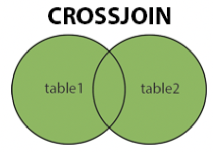

# Cross join

**CROSS JOIN** matches each row from the first table with each row of the second table.

<div style="text-align: center">
</img>
</div>

```sql
SELECT * FROM table1 CROSS JOIN table2;
SELECT * FROM table1, table2;
```

You can join multiple instances of the same table :)

```sql
SELECT t1.col1, E2.col2 FROM table1 AS t2 CROSS JOIN table2 AS t2; 
```
