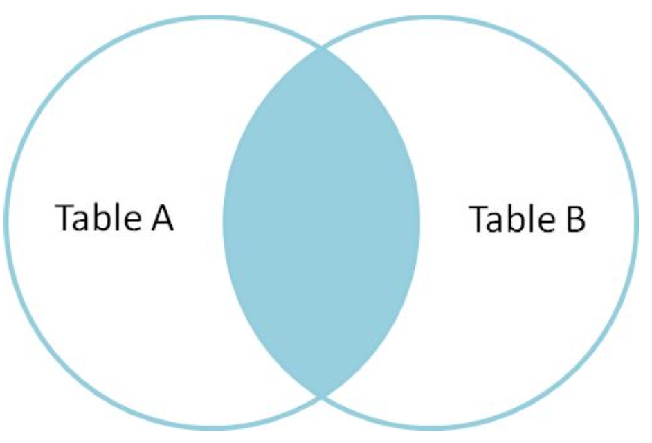

# Inner join

**INNER JOIN** selects all rows from both tables as long as the condition is met.

<div style="text-align: center">
</img>
</div>

```sql
SELECT t1.col1, t2.col2 FROM table1 AS t1 INNER JOIN table2 AS t2 ON t1.id = t2.id

-- Older SQL syntax
SELECT t1.col1, t2.col2 FROM table1 AS t1, table2 AS t2 WHERE t1.id = t2.id
```
