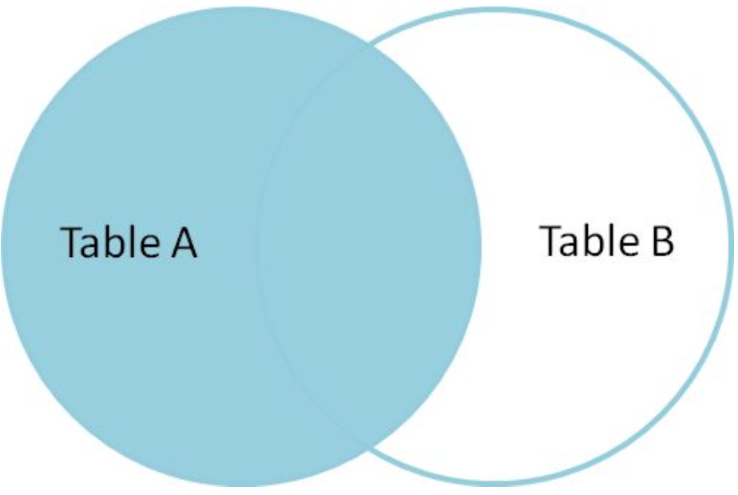

# Left join

**LEFT JOIN** returns all the rows of the table on the left side of the join and matching rows of the table on the right side of the join. For the rows for which there is no matching row on right side, the result-set will contain null.

<div style="text-align: center">
</img>
</div>

```sql
SELECT column_name(s)
FROM table1
LEFT JOIN table2
ON table1.column = table2.column

SELECT column_name(s)
FROM table1
LEFT OUTER JOIN table2
ON table1.column = table2.column
```
